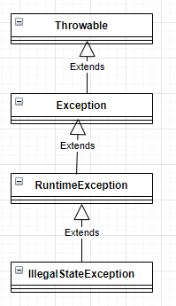

# Controle de Exceções em Java

## Veja a classe Main. 

O controle de exceções é primordial para toda e qualquer aplicação.
Principalmente no mundo Web.

O controle dessas, evitam que nossa aplicação pare abruptamente,
sem tratar ou fornecer um feedback mínimo ao usuário.

Dominar o controle de exceções é criar aplicações preparadas para o mundo real.

## A Herança no controle de exeções | Uncheked e Cheked

A classe mãe das exceções em java é a ```java.lang.Throwable``` .
Existem duas divisões para o tratamentos delas, são:
   1. Uncheked;
   2. Cheked.

Antes de falar sobre esses dois tipos, vamos falar sobre a herança envolvida nos níveis inferiores.
Funciona assim:



Logicamente, existem outras classes, mas essas são suficientes para eu me expressar.
```java.lang.Throwable``` é a classe capaz de lançar objetos na fila de execução do java.
Objetos de erros e/ou exceções.

Logo após vem a classe ```java.lang.Exception```.
Você pode criar suas próprias exceções estendendo dessa classe.
Se você estender diretamente dessa classe, terá uma exceção do tipo Checked.
Isso significa que em tempo de escrita você já sabe que ali pode ocorrer um problema.
Sabendo disso, o compilador te "obriga" a realizar um tratamento.

O Java possui inúmeras classes de exceções nativas.
Algumas delas são ckekeds e outras unchekeds.
Um exemplo de unchekeds é a famosa  ```java.lang.NullPointerException```.
Essa só fica "visível" em tempo de execução.
As IDEs te ajudam a evitar em tempo de escrita, mas quem nunca passou por essa, que atire a primeira pedra.

Por acontecer em tempo de execução ela é unchekeds.
O compilador não vai te obrigar a tratá-la, pois na teoria ele não sabe que ela pode acontecer.

Outro exemplo é a ```java.lang.IllegalStateException```,
percebe pela imagem que essa estende primeiramente da classe
```java.lang.RuntimeException```.

Você deve evitar criar exceções que já existem na API nativa do Java.
Quando for necessário, crie exceções que descrevam o problema pelo seu nome.
Para uma boa legibilidade, sempre adicione Exception no final.
```MinhaException```

## Fechando recursos de forma inteligente

Além de evitar que o programe se encerre de forma inesperada, o controle de exceções nos ajuda a
controlar melhor os recursos utilizados pela a aplicação.
Por exemplo, conexões com o banco, tokens de api e etc.
Para isso além do try e o catch, temos  o finally.
O finally sempre é executado, independente se ocorreu erro ou não.
Ideal para conexões externas a aplicação. 

A API nativa do Java, após a versão 1.7, tem uma forma mais inteligente de fechar os recursos.
Com o try-with-resources.
Veja sobre a classe ``java.lang`.AutoCloseable``

## Escrevendo melhor

Utilize o controle de exceções para diminuir a complexibilidade de seus códigos.
Menos ifs, menos decisões em tempo de execução.
As exceções interrompem o fluxo da aplicação, use isso ao seu favor.

````
if(saldo > 0 ){
   // você pode sacar
}else{
  // você NÃO pode sacar
}

````

por

````
if(saldo < 0 )
   throw new Exception("Você não pode sacar.");
//Você pode sacar
````